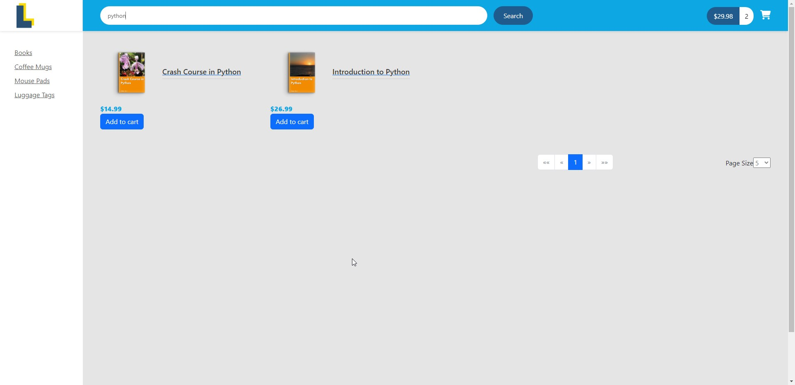
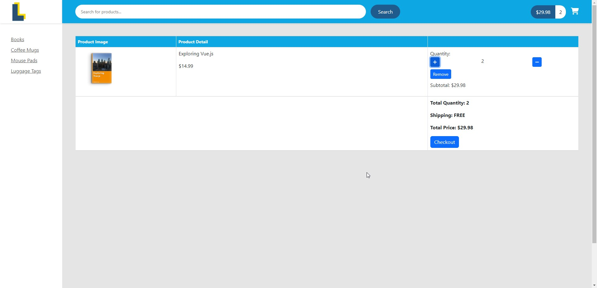
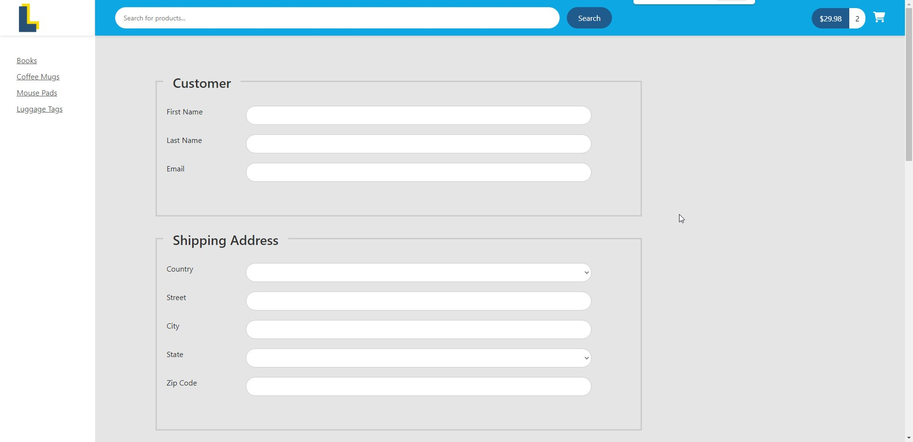

# full-stack-ecommerce

## Description
This is a full stack ecommerce website built with React, Redux, Node, Express, MongoDB, and Stripe. It is a fully functional ecommerce website with a shopping cart, user authentication, and payment processing with Stripe. It also has an admin area where you can upload products, edit products, delete products, and create product categories.

## Demo
# Home Page

# Search Page

# Cart Page

# Checkout Page

